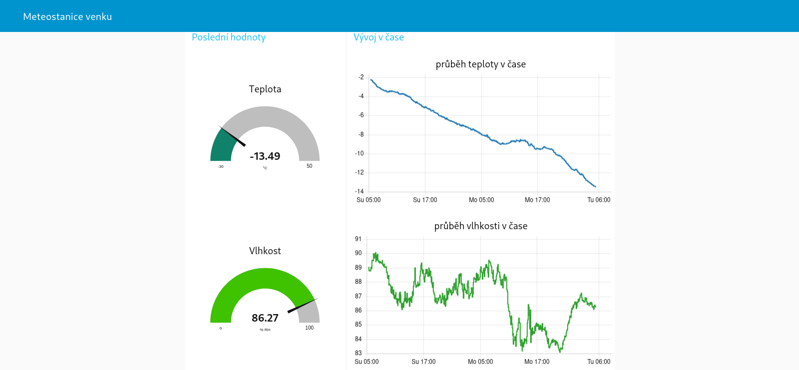

# iot-weather-logger

IoT weather logger is an Arduino Nano 33 IoT based weather station that reads data about temperature, humidity and air pressure using sensors DHT22 and BMP180. It then sends them periodically to a device running a Node-RED instance taht displays the info on a web dashboard. Node-RED flow is also configured to send the data to Blynk cloud.

## Ignored file should look like this:

### src/arduino_code/arduino_secrets.h
```
#pragma once
#define SECRET_SSID "your ssid"
#define SECRET_PASS "your password"

```
In the Node-RED flow don't forget to rewrite the API_KEY in order to send data to Blynk cloud.

## Photos of the weather station


## Screenshots of dashboards
### In Node-RED:

### In Blynk cloud:

